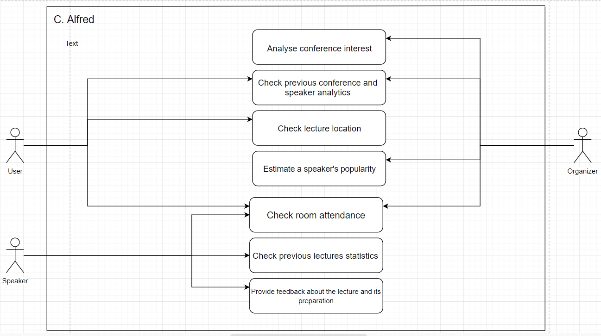
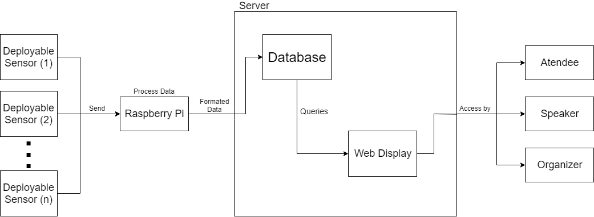
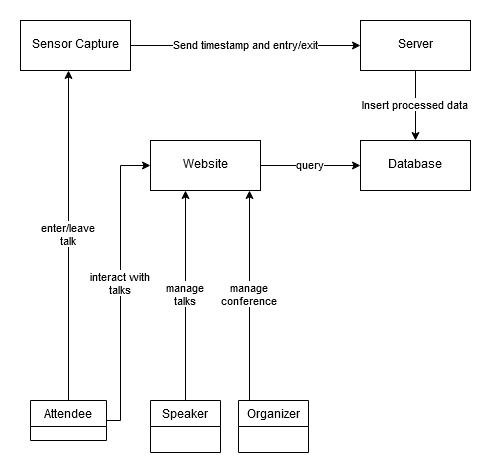
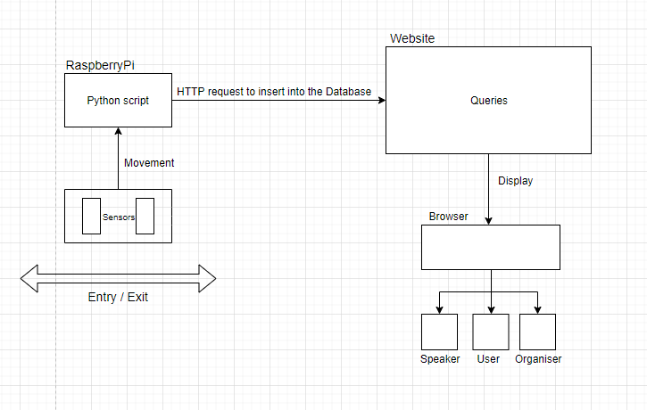

# openCX-CounterCode Development Report

Welcome to the documentation pages of the C.Alfred of **openCX**!

You can find here detailed about the C.Alfred, hereby mentioned as module, from a high-level vision to low-level implementation decisions, a kind of Software Development Report, organized by discipline ESOF: 

* Business modeling 
  * [Product Vision](#Product-Vision)
  * [Elevator Pitch](#Elevator-Pitch)
* Requirements
  * [Use Case Diagram](#Use-case-diagram)
  * [User stories](#User-stories)
  * [Domain model](#Domain-model)
* Architecture and Design
  * [Logical architecture](#Logical-architecture)
  * [Physical architecture](#Physical-architecture)
  * [Prototype](#Prototype)
* [Implementation](#Implementation)
* [Test](#Test)
* [Configuration and change management](#Configuration-and-change-management)
* [Project management](#Project-management)

So far, contributions are exclusively made by the initial team, but we hope to open them to the community, in all areas and topics: requirements, technologies, development, experimentation, testing, etc.

Please contact us! 

Thank you!

*team members names*

---

## Product Vision

An important piece of data for a conference is knowing the attendance and time spent in any given talk.
This information benefits everyone involved, be it organizers, speakers or attendees through data collection.
Using two motion sensors on each door, lecture attendance data can be collected with acceptable precision. For each person that walks through the door, the motion sensors can determine wether they are entering or leaving the room giving us a rough estimate of how many people are in the room at each given time.

---
## Elevator Pitch
Have you ever rushed to a lecture just to find out there are no more seats available? Wouldn't be great to know that information beforehand? Not only will C.Alfred provide the number of seats available in real time but also access where the lecture is being held, its schedule, the speaker history, including feedback from his previous talks and so much more!

---
## Requirements

[Non-functional]
Document changes in conference space occupancy and process them into useful metric for all participants.

[Functional]
Distance measuring sensor unit (Sharp 2Y0A21 F 19)
Raspberry PI B 3+

Sensor unit outputs a voltage based on detection distance. This voltage change is processed by the raspberry pi and is correlated to a person entering the conference space.

### Use case diagram 

**Check room attendance**

Actor: User, Speaker and Organizer

Description: Providing information relative to the number of people that are attending or attended a lecture.

Preconditions and Postconditions: Carry a portable device with access to the Internet.

Normal Flow: 	
  1. Access the website.
  2. Search for the lecture you are interested in.
  3. Check the room attendance
  4. Head to the room displayed on the website.
  5. Find yourself a seat and enjoy the lecture.

Alternative Flows and Exceptions:
  1. Access the website.
  2. Search for the lecture you are interested in.
  3. Check the room attendance.
  4. If the room is full, search for another lecture that isn’t.
  
 
**Get previous conference or speaker analytics**

Actor: User and Organizer

Description: Providing information relative to a conference or speaker.

Preconditions and Postconditions: Carry a portable device with access to the Internet.

Normal Flow: 	
  1. Access the website.
  2. Search for the speaker and conference you are interested in.
  3. Check the feedback.

Alternative Flows and Exceptions: There are none.

**Check previous lectures statistics**

Actor: Speaker

Description: Providing feedback relative to a talk held by the speaker.

Preconditions and Postconditions: Carry a portable device with access to the Internet.

Normal Flow: 	
  1. Access the website.
  2. Search for the lectures in which you will talk.
  3. Check the feedback.

Alternative Flows and Exceptions: There are none.

**Analyse conference interest**

Actor: Organizer

Description: Providing information relative to the number of people that are attending or attended a lecture and their feedback.

Preconditions and Postconditions: In order to check the room attendance, the lecture must started or ended. The overall feedback is only available after people posted their opinion. Also the organizer needs to be able to access the internet.

Normal Flow: 	
  1. Access the website.
  2. Search for the lecture you are interested in.
  3. Check the room attendance.
  4. Check the attendees feedback regarding the conference.

Alternative Flows and Exceptions:
  1. Access the website.
  2. Search for the lecture you are interested in.
  3. Check the attendees feedback regarding the conference.
  4. Check the room attendance.
  

**Check lecture location**

Actor: User and Speaker

Description: Providing information relative to where the lecture will take place.

Preconditions and Postconditions: Carry a portable device with access to the Internet.

Normal Flow: 	
  1. Access the website.
  2. Search for the lecture you are interested in.
  3. Check the room where the lecture is being held.

Alternative Flows and Exceptions: There are none.

**Provide feedback about the lecture and its preparation**

Actor: Speaker

Description: Providing feedback relative to the preparation thelectures itself the Speaker participated in.

Preconditions and Postconditions: The lectures must have ended already and the Speaker needs to be able to access the Internet.

Normal Flow: 	
  1. Access the website.
  2. Search for the lecture you participated in.
  3. Write your opinion regarding the lecture and its preparation.

Alternative Flows and Exceptions: There are none.

**Estimate a certain speaker’s popularity**

Actor: Organizer

Description: Give a “rating” to each speaker based on his reviews on other conferences.
Preconditions and Postconditions: The Speaker must have had at least one talk in other conference and must have at least one review.

Normal Flow: 	
  1. Access the website.
  2. Search for the speaker you are interested in.
  3. Check its popularity.

Alternative Flows and Exceptions: There are none.

### User stories

[User Stories](https://trello.com/b/TEjaBTpK/user-stories)

### Domain model

---

## Architecture and Design

Sensor connected to RaspberryPi running python
Web server running website and database
Website: information displayed and some features: feedback form, add a talk, check room attendance, register speakers accounts.
RaspberryPi: Processes entrances and sends the information to the webserver.

   In order to calculate the room attendance, a RaspberryPi running a python script is used to determine if a person entered or left the room using two distance measuring sensors and the sequence by which they are triggered.
   As a way of adding the entries and exits of the several lectures, the RaspberryPi sends a HTTP request to the server and inserts the formated data into the database.
   ... (queries da base de dados e os forms online no site)
   With all this data available in the website, every atendee, speaker or organizer can check it with their phone.

### Logical architecture

### Physical architecture

### Prototype
To help on validating all the architectural, design and technological decisions made, we usually implement a vertical prototype, a thin vertical slice of the system.

In this subsection please describe in more detail which, and how, user(s) story(ies) were implemented.

---

## Implementation
During implementation, while not necessary, it 

It might be also useful to explain a few aspects of the code that have the greatest potential to confuse software engineers about how it works. 

Since the code should speak by itself, try to keep this section as short and simple as possible.

Use cross-links to the code repository and only embed real fragments of code when strictly needed, since they tend to become outdated very soon.

---
## Test

There are several ways of documenting testing activities, and quality assurance in general, being the most common: a strategy, a plan, test case specifications, and test checklists.

In this section it is only expected to include the following:
* test plan describing the list of features to be tested and the testing methods and tools;
* test case specifications to verify the functionalities, using unit tests and acceptance tests.
 
A good practice is to simplify this, avoiding repetitions, and automating the testing actions as much as possible.

---
## Configuration and change management

Configuration and change management are key activities to control change to, and maintain the integrity of, a project’s artifacts (code, models, documents).

For the purpose of ESOF, we will use a very simple approach, just to manage feature requests, bug fixes, and improvements, using GitHub issues and following the [GitHub flow](https://guides.github.com/introduction/flow/).

---

## Project management

Software project management is an art and science of planning and leading software projects, in which software projects are planned, implemented, monitored and controlled.

In the context of ESOF, we expect that each team adopts a project management tool capable of registering tasks, assign tasks to people, add estimations to tasks, monitor tasks progress, and therefore being able to track their projects.

Example of tools to do this are:
  * [Trello.com](https://trello.com)
  * [Github Projects](https://github.com/features/project-management/com)
  * [Pivotal Tracker](https://www.pivotaltracker.com)
  * [Jira](https://www.atlassian.com/software/jira)

We recommend to use the simplest tool that can possibly work for the team.
